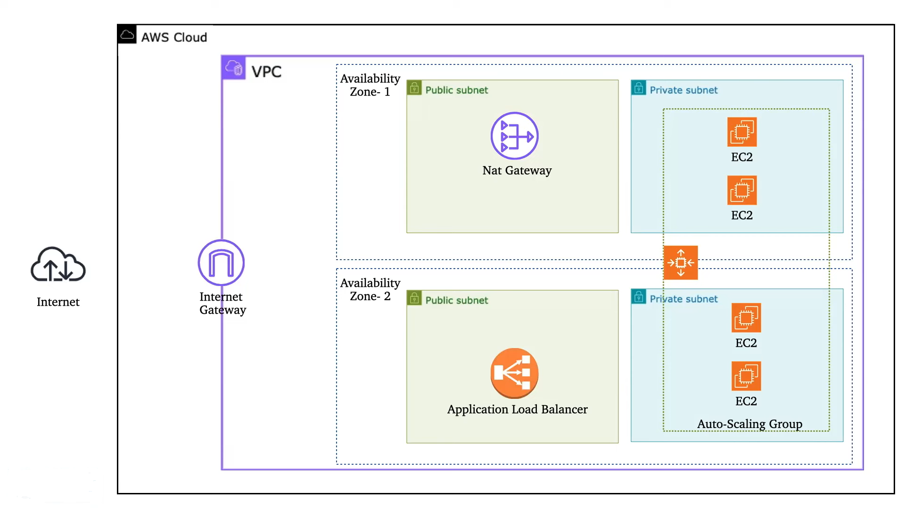
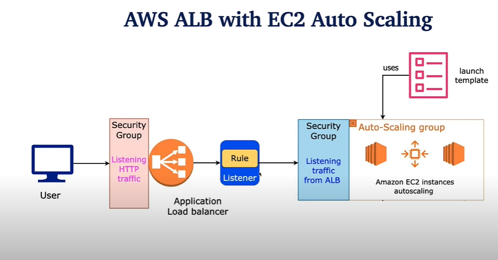

# Terraform Configuration for Auto Scaling Group (ASG) and Application Load Balancer (ALB)

## Overview

This documentation describes the setup of an Auto Scaling Group (ASG) and an Application Load Balancer (ALB) within an Amazon Virtual Private Cloud (VPC) using Terraform. The configuration includes the creation of a launch template, an ALB, a target group, and the ASG itself. The goal is to automate the deployment of a scalable and highly available application infrastructure.



## Components

### 1. **Launch Template**

**Purpose**: The launch template defines the configuration for EC2 instances that will be managed by the Auto Scaling Group.

- **AMI (Amazon Machine Image)**: Specifies the image used to launch the instances, including the operating system and pre-installed software.
- **Instance Type**: Defines the hardware configuration of the instances, such as CPU, memory, and storage.
- **Key Pair**: Used for SSH access to the instances.
- **Network Configuration**: Includes settings such as public IP assignment and IAM instance profile attachment.
- **User Data**: A script that runs on instance startup, often used for initial configuration tasks.

### 2. **Application Load Balancer (ALB)**

**Purpose**: The ALB distributes incoming application traffic across multiple targets, such as EC2 instances, to ensure high availability and reliability.

- **Load Balancer**: Created to handle incoming traffic and route it to the appropriate targets. It operates at the application layer (Layer 7) of the OSI model.
- **Listeners**: Defined to handle requests on specific ports (e.g., HTTP on port 80 and HTTPS on port 443). Listeners are configured to forward traffic to a target group based on rules.
- **Security Groups**: Associated with the ALB to control inbound and outbound traffic to ensure only authorized access.

### 3. **Security Groups**

**Purpose**: Security Groups act as virtual firewalls for controlling inbound and outbound traffic to AWS resources. In this setup, separate security groups have been created for both the Application Load Balancer (ALB) and the Auto Scaling Group (ASG) to ensure secure and controlled access.

- **ALB Security Group:** Manages incoming traffic to the load balancer and controls which sources can access it, as well as allowing outbound traffic to the target group.

- **ASG Security Group:** Manages incoming traffic to EC2 instances launched by the ASG, typically allowing only traffic from the ALB and managing outbound traffic based on application needs.


### 4. **Target Group**

**Purpose**: The target group is used by the ALB to route traffic to registered targets.

- **Health Check**: Monitors the health of the targets (e.g., EC2 instances) to ensure that traffic is only routed to healthy instances.
- **Protocol and Port**: Defines the protocol (e.g., HTTP) and port on which the targets accept traffic.

### 5. **Auto Scaling Group (ASG)**

**Purpose**: The ASG manages the number of EC2 instances based on demand.

- **Launch Template**: The ASG uses the launch template to create instances.
- **Scaling Policies**: Automatically adjusts the number of instances in response to changes in traffic or load.
- **Desired Capacity**: Specifies the desired number of instances in the ASG.
- **Health Check**: Ensures instances are healthy and replaces any that fail health checks.

## Workflow

1. **Instance Launch**: When a new instance is needed, the ASG uses the launch template to create it.
2. **Load Balancing**: The ALB distributes incoming traffic to the instances based on the configured listeners and target group.
3. **Scaling**: The ASG monitors the load and scales the number of instances up or down based on predefined policies.



## Benefits

- **Scalability**: The ASG automatically adjusts the number of instances based on load, ensuring the application can handle varying traffic volumes.
- **High Availability**: The ALB distributes traffic across multiple instances, improving fault tolerance and uptime.
- **Automation**: Terraform automates the provisioning and management of infrastructure, reducing manual effort and potential for errors.

## Usage

1. Clone the repository:
   ```bash
   git clone https://github.com/saeedalig/AWS-Terraform.git
   # Navigate to dir
   cd asg
   ```

2. Initialize Terraform:
  ```bash
  terraform init
  ```
3. Plan the configuration:
  ```bash
  terraform plan
  ```

4. Apply the configuration:
  ```bash
  terraform apply
  ```


## Conclusion

This setup ensures a robust, scalable, and highly available architecture for deploying applications on AWS. By leveraging Terraform, the entire infrastructure can be managed as code, making it easier to deploy, update, and maintain.

